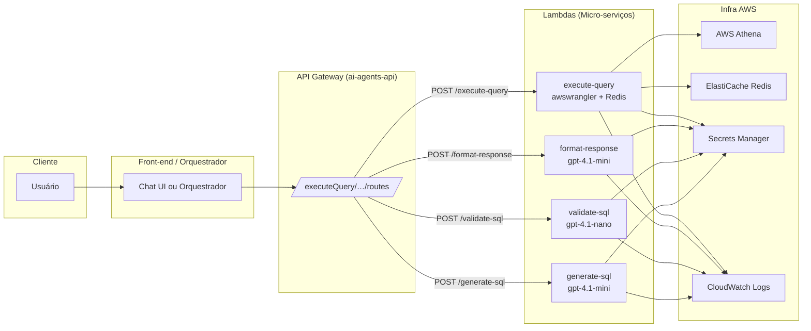

# SQL Executor Agent (MVP)

Este projeto implementa um **chatbot conversacional serverless** que:

- Recebe pedidos em linguagem natural
- Gera e valida uma query SQL
- Executa a query no Amazon Athena com cache em Redis
- Formata e humaniza o resultado de volta ao usuário

Foi concebido como um **MVP de baixo custo** usando variantes do Azure OpenAI GPT-4.

---

## 🏗 Arquitetura

---

## 🔄 Fluxo Resumido

1. **Chat UI / Orquestrador** recebe a mensagem do usuário.
2. Chama sequencialmente as rotas da API Gateway:
   - **Agent 1 – generate-sql** (gpt-4.1-mini): Converte o pedido em SQL (SELECT).
   - **Agent 2 – validate-sql** (gpt-4.1-nano): Verifica ausência de cláusulas destrutivas (DROP, DELETE, ALTER etc.).
   - **Executor – execute-query**: Lambda em Python usando `awswrangler`.
     - Checa cache no Redis. Se não existir, dispara consulta no Athena, armazena resultado no Redis e retorna dados.
   - **Agent 3 – format-response** (gpt-4.1-mini): Humaniza e formata a saída (tabelas, narrativas, insights).

---

## 🧩 Componentes

### API Gateway (`ai-agents-api`)

- Gerencia as rotas REST:
  - `POST /generate-sql` → Agent 1
  - `POST /validate-sql` → Agent 2
  - `POST /execute-query` → Executor
  - `POST /format-response` → Agent 3

### Lambdas

- **Agent1**: gpt-4.1-mini para geração de SQL
- **Agent2**: gpt-4.1-nano para validação de SQL
- **Executor**: Python + `awswrangler` para Athena + cache Redis
- **Agent3**: gpt-4.1-mini para formatação da resposta

### Infraestrutura

- **ElastiCache Redis**: Cache de resultados para acelerar queries repetidas.
- **AWS Secrets Manager**: Armazenamento seguro de chaves e credenciais (openai-api-key etc.).
- **Azure OpenAI Service**: Endpoints configurados para gpt-4.1-mini e gpt-4.1-nano.
- **Amazon Athena + S3**: Data warehouse serverless para execução de SQL.
- **CloudWatch Logs**: Centralização de logs de todas as Lambdas para monitoramento e debugging.

---

## 🚀 Como Executar

1. Configure variáveis de ambiente no AWS Secrets Manager:
   - `OPENAI_API_KEY`
   - Credenciais de acesso ao Athena e Redis
2. Faça deploy da stack (CDK, Terraform ou CloudFormation).
3. Acesse o endpoint da API Gateway e envie requisições conforme o fluxo acima.

---

## 📖 Referências

- [Azure OpenAI Service Documentation](https://learn.microsoft.com/azure/ai-services/)
- [AWS Athena](https://aws.amazon.com/athena/)
- [ElastiCache Redis](https://aws.amazon.com/elasticache/redis/)
- [CloudWatch Logs](https://aws.amazon.com/cloudwatch/)
