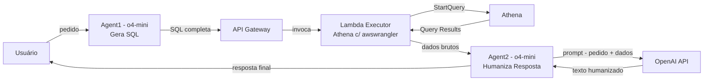

# SQL Executor Agent

This agent exposes an endpoint via API Gateway that triggers a Lambda function. The function receives user parameters, runs a query on Athena, and formats the output. Before returning, it caches the results in Redis so that identical requests can be served instantly next time, avoiding additional Athena calls.

## Componentes

- **API Gateway (`ai-agents-api`)**

  - Roteia tudo através de três rotas:
    - `POST /generate-sql` → invoca **Agent1**
    - `POST /execute-query` → invoca **Executor**
    - `POST /format-response` → invoca **Agent2**

- **Lambda Functions**

  - **Agent1:** Gera a query SQL com base no prompt do usuário, usando OpenAI.
  - **Executor:** Executa a query no Athena e retorna resultados.
  - **Agent2:** Gera a resposta humanizada com base nos dados da query.

- **AWS Secrets Manager**

  - Armazena a chave `openai-api-key` usada pelas Lambdas.

- **OpenAI API**

  - Modelo de linguagem (por exemplo, `gpt-4` ou `gpt-3.5-turbo`).

- **Amazon Athena**

  - Executa queries SQL sobre dados armazenados no S3.

- **CloudWatch Logs**
  - Coleta logs de todas as funções para monitoramento e depuração.

---

Este diagrama e descrição refletem o código Terraform e a implementação das Lambdas, facilitando a compreensão da infraestrutura e dos fluxos de dados.
